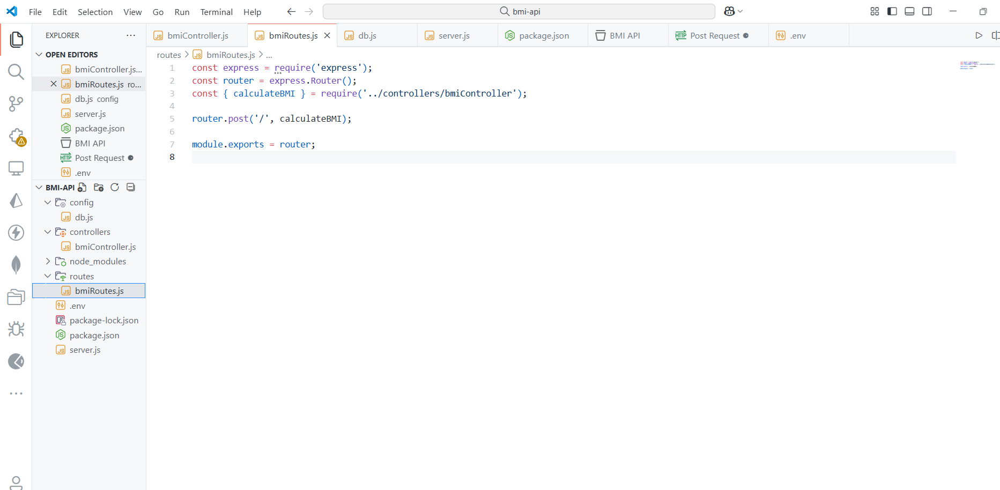
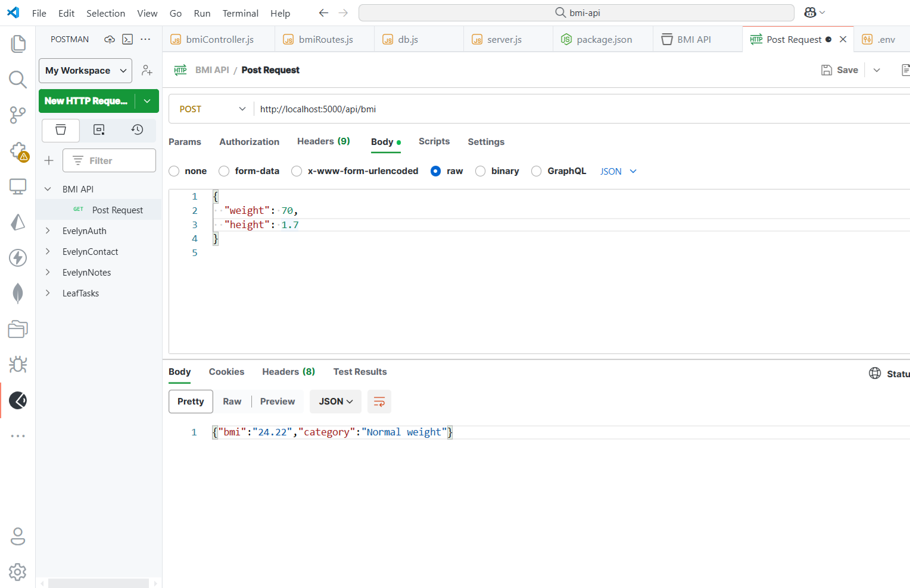

# 📱🐢 BMI Calculator API

Welcome to the **BMI Calculator API** — a clean, scalable backend service for calculating Body Mass Index based on weight and height input.  
Built with precision, modular architecture, and a touch of elegance 

<p align="center">
  
  <br/>
  <em>Project structure — clean, modular, and professional</em>
</p>

---

## Features

- Calculate BMI using `POST /api/bmi`
- Auto-categorize (Underweight, Normal, Overweight, Obese)
- Modular MVC structure
- MongoDB integration (ready for future extensions)
- Built with `Node.js`, `Express`, and `Mongoose`
- Clean `.env` + script `npm run dev` ready

---

## API Endpoint

### POST `/api/bmi`

**Request Body (JSON):**
```json
{
  "weight": 70,
  "height": 1.7
}

Response:
```json
{
  "bmi": "22.86",
  "category": "Normal weight"
}


---

## Tech Stack
- Backend: Node.js, Express.js
- Database: MongoDB, Mongoose
- Utilities: dotenv, nodemon, cors
- Architecture: MVC-style folder structure
- Tested With: Postman 🐢

---

## Run Locally

1.Clone repo:

```bash
git clone https://github.com/ricoaprillananda/bmi-calculator-api.git
cd bmi-calculator-api

2.Install dependencies:

```bash
npm install

3.Tambahkan .env:

```env
MONGO_URI=your_mongodb_uri
PORT=5000

4.Run server:

```bash
npm run dev

---

## Preview

| Postman Test                                     | Struktur Folder                                       |
| ------------------------------------------------ | ----------------------------------------------------- |
|  |  |


“Don’t just build code — build systems that feel alive.”

## Built By

Coded with elegance, clarity, and intention 🍃:

- **Rico Aprilla Nanda**  
  [GitHub](https://github.com/ricoaprillananda) ・ [LinkedIn](https://www.linkedin.com/in/rico-aprilla-n-3335a7251)

